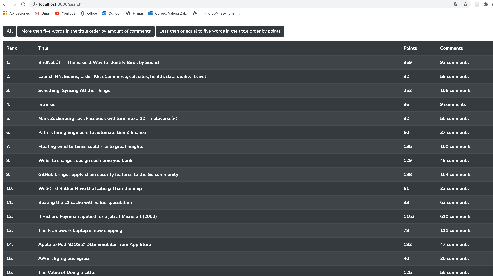
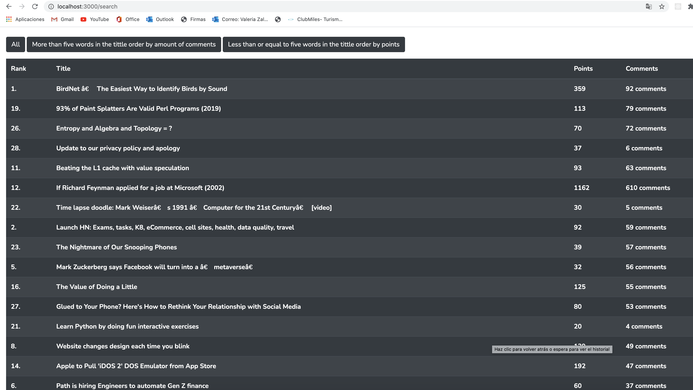
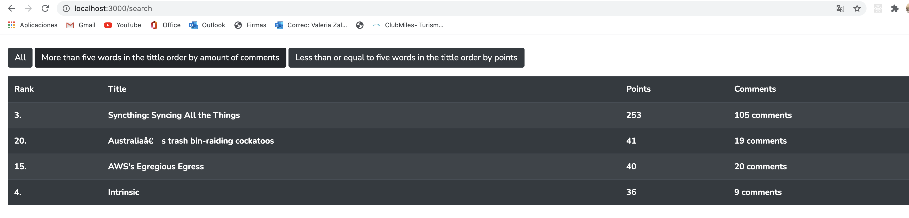

# Web Crawler

This is my version of a web crawler. I used guzzlehttp/guzzle for helpme to consume the
[page](https://news.ycombinator.com).

## Installation

This program requires of docker-compose to run.
If you need to install dockergo to [docker](https://www.docker.com/).

The branch of the project is master:

```bash
git checkout master
git pull origin master
```
Please change ".env.example" to ".env"

When you have docker, only run:

```bash
docker-compose up --build
```

```bash
docker exec -it crawler_container php artisan key:generate
```


This will create for the fist time, the next time you need to up the program use:
```bash
docker-compose up
```
When you finish this you see the program in:

[http://localhost:3000/index](http://localhost:3000/index)

## Example
ALL

MORE

LESS


## Autor

### Valeria Zaldumbide
